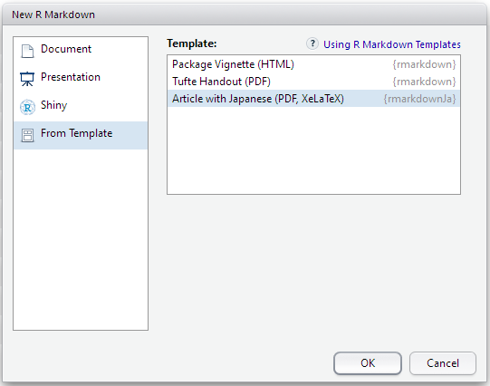

# rmarkdownJa

A R-language package providing Japanese-aware R Markdown template(s).

This package just provides R Markdown template(s) file for writing with Japanese language.
The template consists of YAML header, first chunk for setting up and example contents.

---
このパッケージは、
Windows 環境下での PDF 生成で日本語文字を問題なく扱う R Markdown 設定を、
R Studio の新規ファイル作成で選択できるテンプレートとして提供します。

わざわざパッケージで提供するようなものでもないのですが、
R パッケージ作成の練習がてら作成してみました。
[テンプレートファイル](https://raw.githubusercontent.com/naqtn/rmarkdownJa/master/inst/rmarkdown/templates/ja_pdf_article/skeleton/skeleton.Rmd)
だけをお手元にコピーして使っていただいてもかまいません。

## 前提 TeX 環境

[MikTeX](http://miktex.org/) を Complete インストールした環境で使用してください。
[ダウンロードページ](http://miktex.org/download) で Other Downloads を開き、
"complete TeX/LaTeX system" と書いてあるものを使ってインストールしてください。

（Basic でも動作しそうなものですが PDF 生成に失敗してしまいます。
これは一時的な MikTeX の不具合かもしれません。）

## パッケージとして R Studio に導入する手順

次の操作を R Studio の Console で行ってください。

    install.packages("devtools")
    library("devtools")
    devtools::install_github("naqtn/rmarkdownJa")

メニュー File > New File > R Markdown... > From Template で表示されるテンプレートに
「Article with Japanese (PDF, XeLaTeX)」が追加されます。

